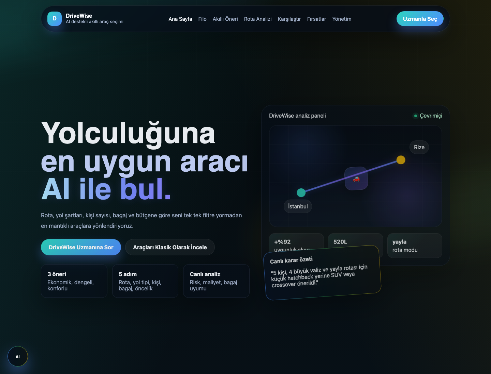
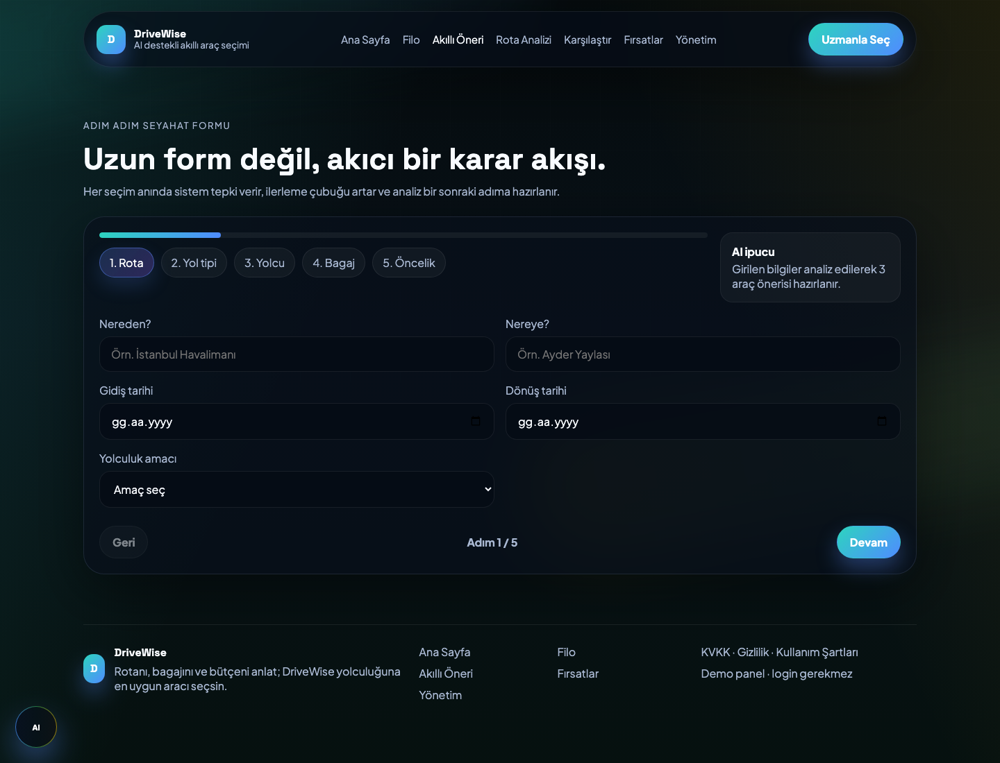
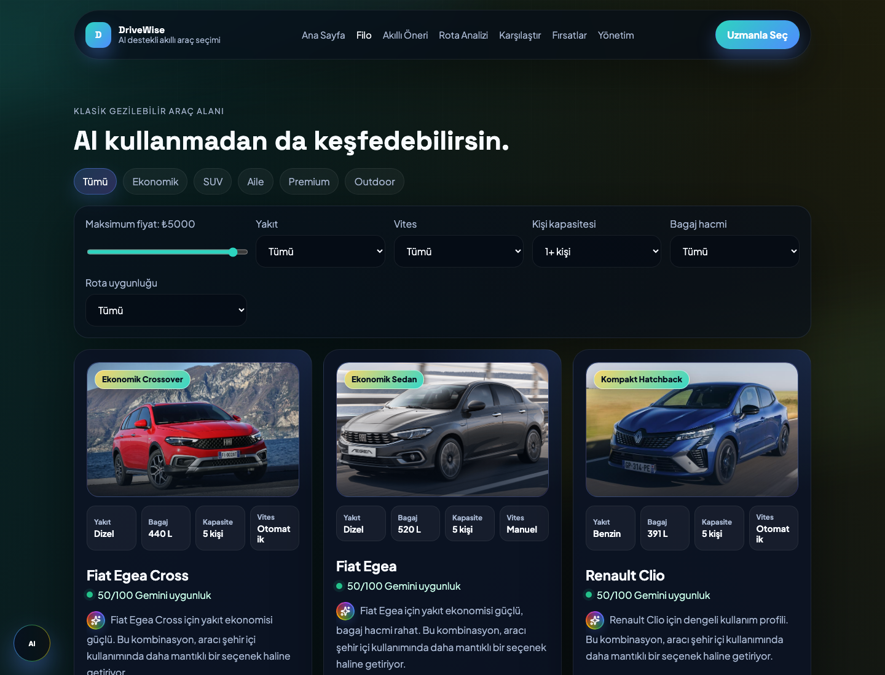
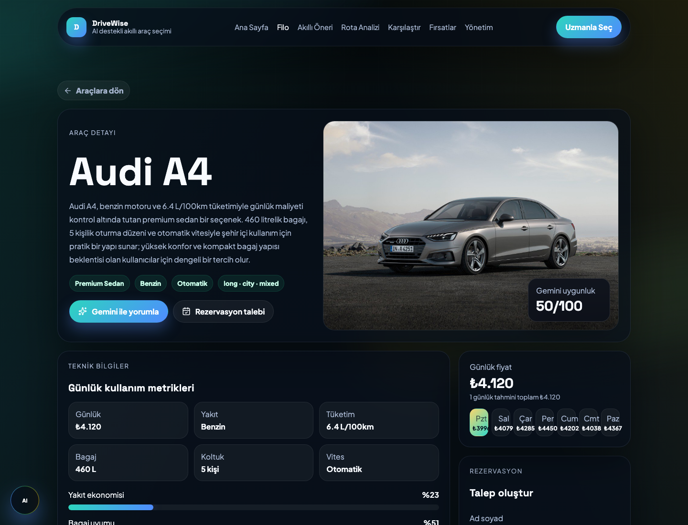
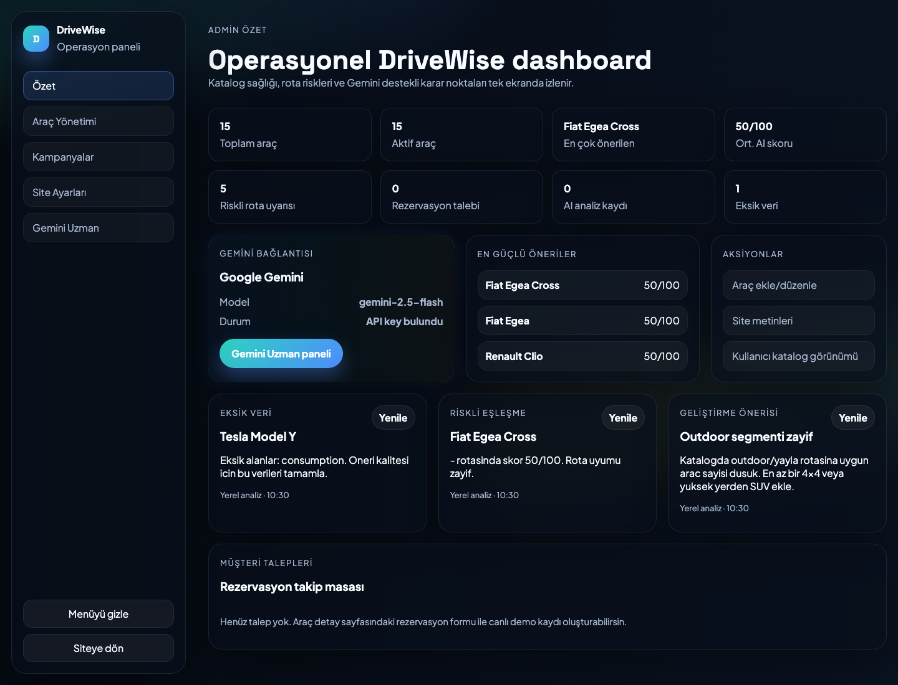

# DriveWise

AI destekli akıllı araç kiralama ve rota öneri platformu.

DriveWise, araç kiralama deneyimini yalnızca fiyat ve model seçimi olmaktan çıkarıp rota, yolcu sayısı, bagaj ihtiyacı, bütçe ve kullanım amacına göre karar veren bir asistana dönüştürür. Kullanıcı birkaç adımda yolculuğunu tarif eder; sistem en uygun araçları ekonomik, dengeli ve konfor odaklı seçenekler olarak sunar.



## Proje Özeti

Araç kiralama platformlarında kullanıcılar çoğu zaman çok sayıda araç kartı arasında manuel karşılaştırma yapmak zorunda kalır. Ancak doğru araç seçimi; gidilecek rota, yol şartları, kişi sayısı, bagaj hacmi, yakıt tüketimi, bütçe ve konfor beklentisi gibi birçok değişkene bağlıdır.

DriveWise bu kararı kullanıcı adına analiz eder. Kullanıcıdan aldığı seyahat verilerini araç kataloğuyla eşleştirir, uygunluk skoru üretir ve önerilerini anlaşılır gerekçelerle sunar. Gemini entegrasyonu canlı açıklama ve sohbet desteği verirken, yerel öneri motoru AI yanıtı alınamayan durumlarda da deneyimin devam etmesini sağlar.

## Öne Çıkanlar

- Rota, yol tipi, kişi sayısı, bagaj ve bütçeye göre araç önerisi
- Ekonomik, dengeli ve konforlu seçeneklerden oluşan öneri seti
- Gemini destekli açıklanabilir AI yorumları
- AI servisleri yanıt vermediğinde çalışan yerel fallback öneri motoru
- Google Routes API ile canlı rota verisi desteği
- Araç kataloğu, detay sayfası, karşılaştırma ve kampanya ekranları
- Operasyon paneli üzerinden araç, kampanya, site içeriği ve AI durumu yönetimi
- Cloudflare Pages Functions uyumlu API yapısı

## Ürün Deneyimi

### Akıllı Öneri Akışı

Kullanıcı uzun bir filtreleme ekranı yerine 5 adımlı bir karar akışından geçer: rota, yol tipi, yolcu, bagaj ve öncelik. Bu bilgiler araç skorlama motoruna aktarılır ve kullanıcıya en mantıklı alternatifler gösterilir.



### Araç Kataloğu

Klasik keşif deneyimi de korunur. Kullanıcı isterse araçları kategori, fiyat, yakıt, vites, kapasite, bagaj ve rota uygunluğuna göre inceleyebilir.



### Araç Detay Sayfası

Detay sayfasında aracın günlük fiyatı, yakıt türü, tüketimi, bagaj kapasitesi, koltuk sayısı, rota uyumu ve Gemini uygunluk yorumu tek ekranda sunulur.



### Admin Paneli

Admin paneli, ürünün yalnızca kullanıcı arayüzünden ibaret olmadığını gösterir. Katalog durumu, AI bağlantısı, öneri kalitesi, eksik veri uyarıları ve operasyonel aksiyonlar aynı panelden izlenebilir.



## AI ve Karar Mekanizması

DriveWise öneri sistemi iki katmandan oluşur:

1. Yerel karar motoru, araçları rota uyumu, bütçe, yolcu kapasitesi, bagaj ihtiyacı, konfor ve performans gibi ölçütlerle skorlar.
2. Gemini katmanı, kullanıcının isteğini doğal dilde yorumlar ve önerileri daha açıklanabilir hale getirir.

Bu yapı sayesinde uygulama yalnızca AI cevabına bağımlı kalmaz. Gemini yoğunluk, API hatası veya anahtar eksikliği gibi durumlarda yerel motor öneri akışını sürdürür.

Agentic yaklaşım şu karar adımlarıyla modellenmiştir:

- Route Analysis: rota ve yol şartlarını yorumlama
- Vehicle Match: araç kataloğuyla ihtiyacı eşleştirme
- Budget Optimization: bütçe ve yakıt maliyetini değerlendirme
- Safety & Suitability: bagaj, koltuk ve rota risklerini kontrol etme
- Explanation: kullanıcıya anlaşılır öneri gerekçesi üretme

## Teknik Mimari

Proje React ve Vite üzerine kurulu tek sayfa uygulamasıdır. Sayfa geçişleri React Router ile yönetilir. Seyahat formu, araç kataloğu ve öneri çıktıları `TripContext` üzerinden ortak state yapısıyla beslenir.

API anahtarları istemci tarafında doğrudan kullanılmaz. Yerel geliştirmede Vite middleware, production ortamında ise Cloudflare Pages Functions istekleri proxy olarak yönetir.

```text
.
├── functions/api/          # Gemini ve Google Routes proxy endpointleri
├── public/                 # Statik public dosyalar
├── src/
│   ├── components/         # Layout ve ortak UI bileşenleri
│   ├── pages/              # Kullanıcı ve admin sayfaları
│   ├── photos/             # Araç görselleri
│   ├── services/           # AI, harita ve öneri servisleri
│   ├── App.jsx             # Route yapısı
│   ├── TripContext.jsx     # Global uygulama state'i
│   └── data.js             # Demo araç/kampanya datası ve skorlama yardımcıları
├── styles.css
├── vite.config.js
└── DATASET.md
```

## Teknolojiler

| Alan | Teknoloji |
| --- | --- |
| Frontend | React 18, Vite 5 |
| Routing | React Router DOM |
| UI ikonları | Lucide React |
| AI | Google Gemini API |
| Harita/Rota | Google Routes API |
| Serverless API | Cloudflare Pages Functions |

## Sayfalar

| Route | Açıklama |
| --- | --- |
| `/` | Ana sayfa |
| `/planner` | Akıllı rota ve araç öneri formu |
| `/analysis` | Analiz sonucu ekranı |
| `/vehicles` | Araç kataloğu |
| `/vehicles/:vehicleId` | Araç detay sayfası |
| `/compare` | Araç karşılaştırma |
| `/campaigns` | Kampanyalar |
| `/admin` | Admin ana ekranı |
| `/admin/vehicles` | Araç yönetimi |
| `/admin/campaigns` | Kampanya yönetimi |
| `/admin/site` | Site içerik yönetimi |
| `/admin/ai` | AI yönetim ekranı |

## Kurulum

Projeyi çalıştırmak için Node.js kurulu olmalıdır.

```bash
npm install
```

`.env.example` dosyasını `.env` olarak kopyalayın:

```bash
cp .env.example .env
```

Ortam değişkenlerini doldurun:

```env
GEMINI_API_KEY=
VITE_GEMINI_MODEL=gemini-2.5-flash
GOOGLE_MAPS_API_KEY=
```

Geliştirme sunucusunu başlatın:

```bash
npm run dev
```

Varsayılan lokal adres:

```text
http://localhost:5173
```

Production build için:

```bash
npm run build
```

Build çıktısını önizlemek için:

```bash
npm run preview
```

## API Endpointleri

### `POST /api/gemini`

Gemini API'ye güvenli şekilde istek göndermek için kullanılır. `GEMINI_API_KEY` ve opsiyonel olarak `VITE_GEMINI_MODEL` ortam değişkenlerini okur.

### `POST /api/maps-route`

Google Routes API üzerinden canlı rota bilgisi almak için kullanılır. `GOOGLE_MAPS_API_KEY` ortam değişkeni gereklidir.

## Veri Seti

Demo araç kataloğu `src/data.js` içinde tutulur. Her araç için fiyat, yakıt türü, şanzıman, tüketim, bagaj hacmi, koltuk sayısı, konfor, performans ve rota uyumluluğu gibi alanlar kullanılır.

Veri seti notları için `DATASET.md` dosyasına bakabilirsiniz.

## Takım

- Mahmut Caner Arslan
- Yaren Yılmaz
- Yeşim Köşebaşı

## Hackathon Notu

DriveWise, AI hackathon kapsamında e-ticaret odaklı bir ürün asistanı konsepti olarak geliştirilmiştir. Proje; kullanıcı değeri, teknik mimari, doğruluk, agentic yapı, kullanıcı deneyimi ve sunulabilir ürün bütünlüğü dikkate alınarak tasarlanmıştır.

## Notlar

- `.env` dosyası repoya eklenmemelidir.
- Gemini veya Google Routes API anahtarı yoksa temel öneri akışı yerel motorla çalışmaya devam eder.
- Admin ekranları demo yönetim akışı sunar; production kullanım için kimlik doğrulama ve kalıcı backend entegrasyonu eklenmelidir.
